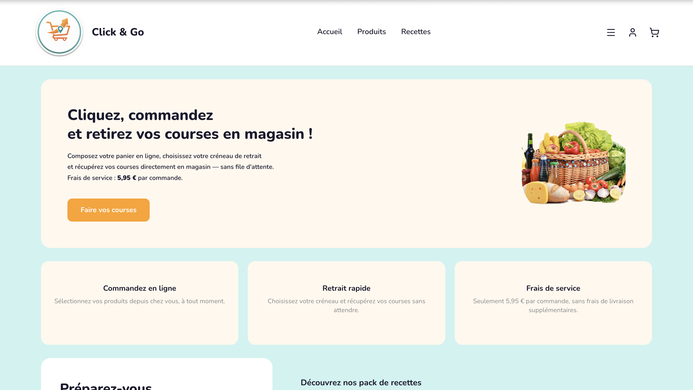

# ClickAndGo

A click-and-collect web application that lets customers browse products and recipes, build a cart, pick a store and a time slot, and then collect their order at the counter — all without waiting in line.

---

## Preview




---

## Table of Contents

- [Overview](#overview)
- [Tech Stack](#tech-stack)
- [Architecture](#architecture)
- [Project Structure](#project-structure)
- [Getting Started](#getting-started)
  - [Prerequisites](#prerequisites)
  - [Database Setup](#database-setup)
  - [Configuration](#configuration)
  - [Run the App](#run-the-app)
- [Test Accounts](#test-accounts)
- [Features by Role](#features-by-role)
  - [Customer](#customer)
  - [Order Picker](#order-picker)
  - [Cashier](#cashier)
- [Order Lifecycle](#order-lifecycle)
- [Session Management](#session-management)
- [License](#license)

---

## Overview

ClickAndGo is a click-and-collect solution for grocery stores. Customers compose their basket online (either by browsing products or by adding a full recipe's ingredients in one click), choose a pickup store and time slot, and confirm their order. Staff members then prepare and validate the order on their dedicated dashboards.

---

## Tech Stack

| Layer | Technology |
|---|---|
| Framework | ASP.NET Core 8 MVC |
| Language | C# 12 |
| Database | Microsoft SQL Server |
| Data access | ADO.NET (raw SQL, no ORM) |
| Auth | Cookie-based session |
| Frontend | Razor Views, custom CSS |
| DB driver | `Microsoft.Data.SqlClient` |

---

## Architecture

The application follows a classic **MVC + DAL** pattern:

```
Controllers/        → Handle HTTP requests, call model or DAL methods
Models/             → Domain objects (Customer, Order, Product, Recipe…)
DAL/                → Data Access Layer, one class per entity + interface
ViewModels/         → Typed objects passed from controllers to views
Views/              → Razor templates, one folder per controller
```

Each DAL is registered as **Transient** in the DI container (stateless, new instance per injection). The `DBConnection` singleton holds only the connection string and is shared safely across requests.

---

## Project Structure

```
ClickAndGoApp/
├── Controllers/
│   ├── AuthController.cs          # Login, register, logout
│   ├── CartController.cs          # Cart CRUD (view, remove, update qty)
│   ├── CashierController.cs       # Cashier dashboard + payment validation
│   ├── CustomerController.cs      # Profile + order history
│   ├── HomeController.cs          # Landing page
│   ├── OrderController.cs         # Checkout (store, time slot, confirm)
│   ├── OrderPickerController.cs   # Picker dashboard + mark ready
│   ├── ProductController.cs       # Browse + add to cart
│   └── RecipeController.cs        # Browse + add ingredients to cart
│
├── DAL/
│   ├── interfaces/                # One interface per DAL class
│   ├── DBConnection.cs            # Singleton connection string wrapper
│   ├── OrderDAL.cs                # Order queries (create, status, timeslot…)
│   ├── ProductDAL.cs
│   ├── RecipeDAL.cs
│   └── …
│
├── Models/
│   ├── Enums/
│   │   ├── OrderStatus.cs         # InTheCart | Pending | Ready | Honored
│   │   └── PaymentStatus.cs       # AwaitingPayment | Paid
│   ├── Customer.cs
│   ├── Order.cs
│   ├── OrderLine.cs
│   ├── Product.cs
│   ├── Recipe.cs
│   └── …
│
├── ViewModels/                    # Typed objects passed to Razor views
├── Views/                         # Razor templates, one folder per controller
├── Database/
│   └── Farhane_Paludetto.sql      # Full DB schema + seed data
├── appsettings.json               # Connection string and logging config
└── Program.cs                     # App bootstrap and DI registrations
```

---

## Getting Started

### Prerequisites

- [.NET 8 SDK](https://dotnet.microsoft.com/download/dotnet/8)
- SQL Server with a running instance

### Database Setup

Open `Database/Farhane_Paludetto.sql` in SSMS (or the integrated SQL tools in your IDE) and execute it against your server. This creates the database, all tables, and seeds the test data including the pre-configured accounts.

### Configuration

Edit `appsettings.json` with your SQL Server connection string:

```json
{
  "ConnectionStrings": {
    "DefaultConnection": "Server=<your-server>;Database=Farhane_Paludetto;User Id=<user>;Password=<password>;TrustServerCertificate=True;"
  }
}
```

The app starts on `https://localhost:5001` (or the port shown in your terminal). Navigate to the home page to begin.

---

## Test Accounts

Three pre-configured accounts are seeded by the SQL script. All use the same password.

| Role | Email | Password | User ID |
|---|---|---|---|
| Customer | alice@test.com | password123 | 7 |
| Order Picker | lucas.picker@clickgo.com | password123 | — |
| Cashier | hugo.cashier@clickgo.com | password123 | — |

---

## Features by Role

### Customer

- **Browse products** — filter by category, view product details
- **Browse recipes** — add all ingredients of a recipe to the cart in one click
- **Cart management** — adjust quantities, remove items
- **Checkout flow**
  1. Review cart
  2. Select a pickup store
  3. Choose an available time slot
  4. Confirm the order
- **Order history** — view past and current orders from the profile page
- **Profile** — update personal info (name, phone, address, password)


### Order Picker

Staff members responsible for physically picking and preparing orders.

- View the list of **pending orders** (`Pending` status)
- Open order details (products, quantities, pickup time)
- Mark an order as **Ready** once it has been prepared

### Cashier

Staff members at the counter responsible for finalizing the handoff.

- View the list of **ready orders** (`Ready` status)
- Select a specific order to process
- Validate payment and mark the order as **Honored** (`Paid`)

---

## Order Lifecycle

```
[Customer adds to cart]
        │
        ▼
  InTheCart  ←──── active cart, stored in session
        │
  [Customer confirms order]
        │
        ▼
    Pending  ←──── visible to Order Pickers
        │
  [Order Picker marks ready]
        │
        ▼
     Ready   ←──── visible to Cashiers
        │
  [Cashier validates payment]
        │
        ▼
    Honored  ←──── order complete, payment = Paid
```

---

## Session Management

The application uses **server-side sessions** (not cookie-based TempData) to avoid payload size limits and improve security.

Key session keys used across the app:

| Key | Type | Description |
|---|---|---|
| `userId` | `int` | ID of the logged-in user |
| `role` | `string` | `Customer`, `OrderPicker`, or `Cashier` |
| `firstName` | `string` | Displayed in the navbar |
| `orderId` | `int` | Active cart order ID |
| `cartCount` | `int` | Badge count in the navbar |
| `selectedStoreId` | `int` | Store chosen during checkout |
| `pendingProductId` | `int` | Product to add after login redirect |
| `pendingRecipeId` | `int` | Recipe to add after login redirect |

Sessions expire after **30 minutes of inactivity**.

---

## License

This project is licensed under the terms of the [LICENSE](LICENSE) file included in this repository.

---

## Authors

**Lucas Paludetto** · **Monaim Farhane**
